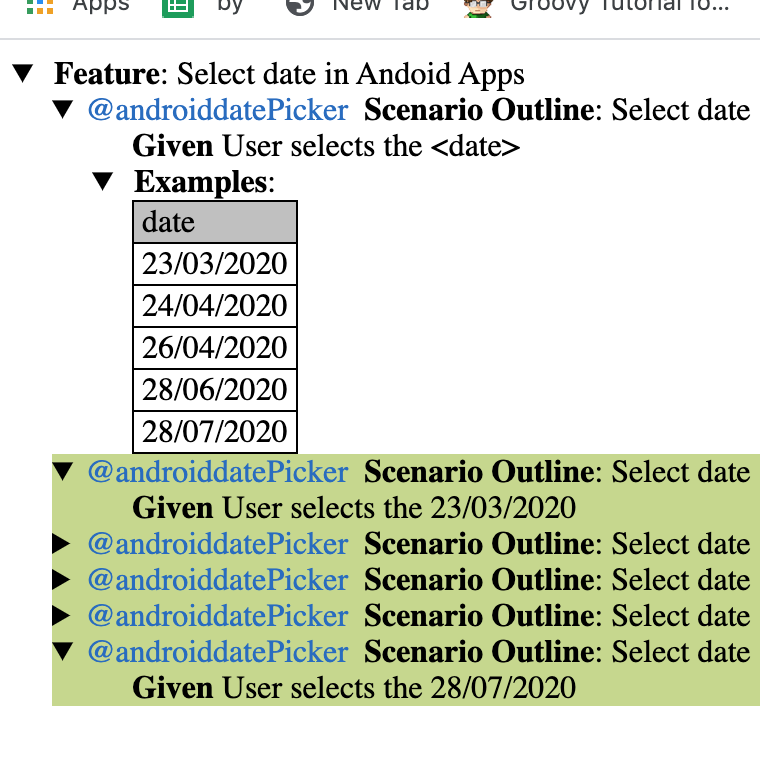
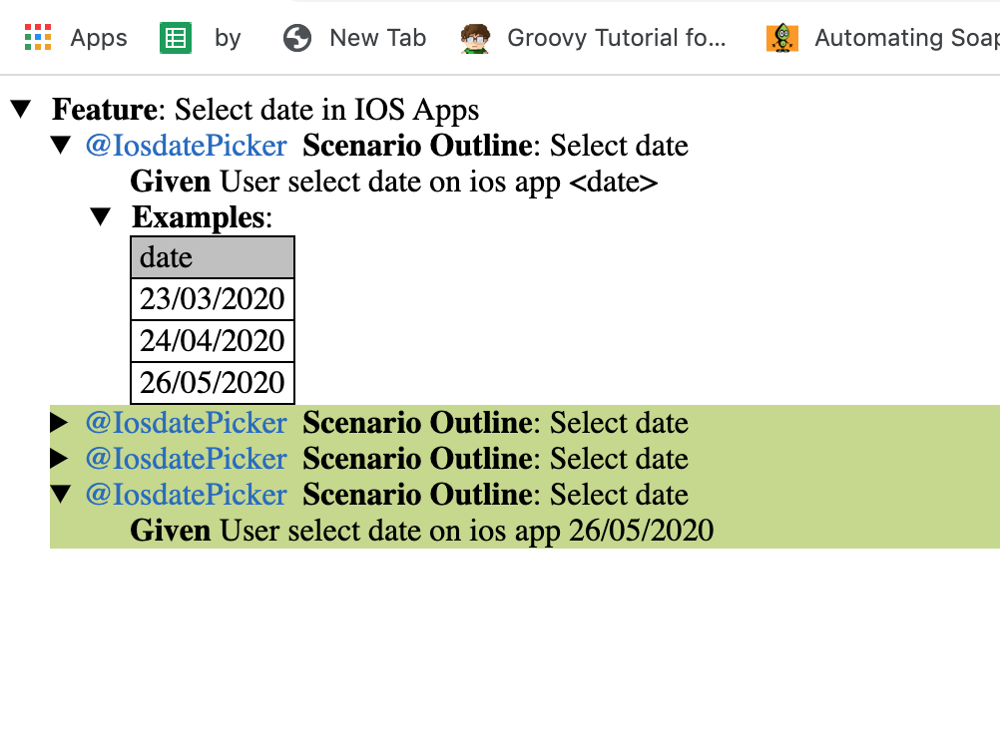

### Automating Android and IOS APP

    This is Automation scripts written with Appium Java and Cucumber for IOS and Android Date picker apps which builds with different UI lay outs
    
    In this Autoamtion challenge i have used same Date format DD/MM/YYYY and used Java Date functions to achive the respective date select in IOS and Android Apps
    
    I have abstrated Driver , Framework Business and Impentation logics separetly in different packages and class.

####  Framework and Folder Structure overview

    ├── Readme.md                 //Information About project
    |
    ├── pom.xml                  // Dependency management and appliction configuration where main execution controlled 
    ├── testng.xml               // This project uses testNg for execution as runner config , realted configuration can be seen here 
    ├── src
    │   ├── main
    │   │   └── java
    │   │       └── webconnector
    │   │           └── WebConnector.java    // This is the main class for Driver initialization for  android and ios  
    │   └── test
    │       ├── config
    │       │   └── application.properties   //  This file holds necessary configuration for driver infomraion like           capabilities and app paths also  use for storing test data
    │       ├── java
    │       │   ├── ApplicationPages           // This package holds UI properties and implementaion logic
    │       │   │   ├── AndroidPages.java      // This class holds  Implemenation , Page Obejcts and Assertions for Android Apps
    │       │   │   └── IOSPages.java         // This class holds  Implemenation , Page Obejcts and Assertions for IOS Apps
    │       │   ├── ConstantVariables      // This  packages holds constans to be used in Test suits
    │       │   │   └── Constant.java      // This class holds  page objects and Driver related constants like waits and Android and Ios page locators 
    │       │   ├── helper
    │       │   │   └── helper.java     // This class holds Common methods and helper methods used for IOS and Android tests
    │       │   ├── runner
    │       │   │   ├── AbstractTestNGCucumberParallelTests.java   // THis will be helpfull if we need to run in parallel mode
    │       │   │   └── Default.java  This    // This is main class for Cucumber and cucuber settigns 
    │       │   └── stepdefs                    // This package holds step definitions for Cucumber feature files
    │       │       ├── AndrodStepDefs.java   // Setp definition for Android Tests
    │       │       ├── BaseClass.java       // THis holds Cucumber @After and @Before Anotaiton responsible for starting Appium sessions for resepectve tests 
    │       │       └── IOSStepDefs.java     // Setp definition for IOS  Tests
    │       └── resource
    │           └── Feature                     // Cucumber Feature file location
    │               ├── androidTests.feature    // Android BDD Tests
    │               └── iOSTests.feature        // IOS BDD Tests
    
    
    
    
 ### To Run IOS Tests 
    Build the App in XCode ( I have faced issue while building in my Xcode due to Swfit version mismatch for this i have made change in AppDelegate.swift changed line no 10 with  UIApplicationLaunchOptionsKey  )
    Provide the  path  to App in     src/test/config/application.properties ->  iosApp or alternatvely  you can provide updatedWDABundleId also
    To Execute tests  run the below command in project root 
    mvn clean install test -DdeviceType=ios -Dcucumber.options="--tags '@IosdatePicker'"
     
     
  ### To Run Android Tests 
     Build the App in Android Studio
     Provide the  path  to App in     src/test/config/application.properties ->  androidApp 
     To Execute tests  run the below command in project root 
     mvn clean install test -DdeviceType=android  -Dcucumber.options="--tags '@androiddatePicker'"
     
 
 ### Sample run results
    Android
    DURATION - 100546
    
    5 Scenarios (5 passed)
    5 Steps (5 passed)
    1m40.547s
    
    
    [INFO] Tests run: 5, Failures: 0, Errors: 0, Skipped: 0, Time elapsed: 101.919 s - in runner.Default
    [INFO] 
    [INFO] Results:
    [INFO] 
    [INFO] Tests run: 5, Failures: 0, Errors: 0, Skipped: 0
    [INFO] 
    [INFO] 
    
    
    
    IOS
    
    DURATION - 42892
    
    3 Scenarios (3 passed)
    3 Steps (3 passed)
    0m42.894s
    
    
    [INFO] Tests run: 3, Failures: 0, Errors: 0, Skipped: 0, Time elapsed: 44.063 s - in runner.Default
    [INFO] 
    [INFO] Results:
    [INFO] 
    [INFO] Tests run: 3, Failures: 0, Errors: 0, Skipped: 0
    [INFO] 
    [INFO] 
    
    

    

    
     
          